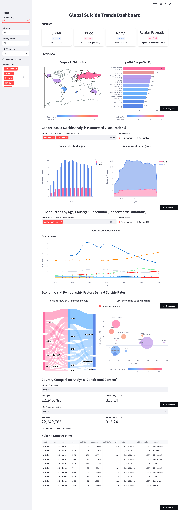

# 🌍 Global Suicide Trends Dashboard

An **interactive data visualization dashboard** built with [Streamlit](https://streamlit.io/), designed to explore **global suicide trends** and provide insights into socio-economic factors.

## Features

- **Interactive Visualizations** – dynamic charts and graphs for exploratory analysis
- **Global Trends Analysis** – track suicide rates over time across countries and regions
- **Cross-Country Comparisons** – compare suicide statistics between selected countries
- **GDP vs Suicide Rates** – analyze correlations between economic indicators and suicide rates

## Getting Started

### 1. Install dependencies

```bash
pip install -r requirements.txt
```

### 2. Run the application

```bash
streamlit run suicide_data_dashboard.py
```

## Data Source

This project uses **cleaned and preprocessed global suicide data** for analysis and visualization.

## Tech Stack

- **Language:** Python
- **Framework:** Streamlit
- **Data processing:** pandas, numpy
- **Visualization:** plotly

## Demo

🔗 **Live Demo:** [View Dashboard](https://suicide-data-dashboard-44bdm9urdx5ao6csm69rq7.streamlit.app/)



## Deployment

The app is deployed on **Streamlit Cloud**.
